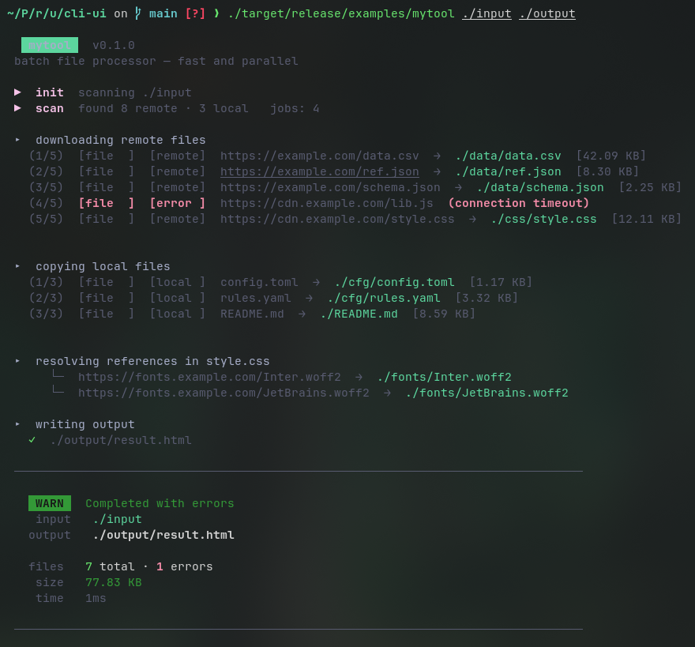
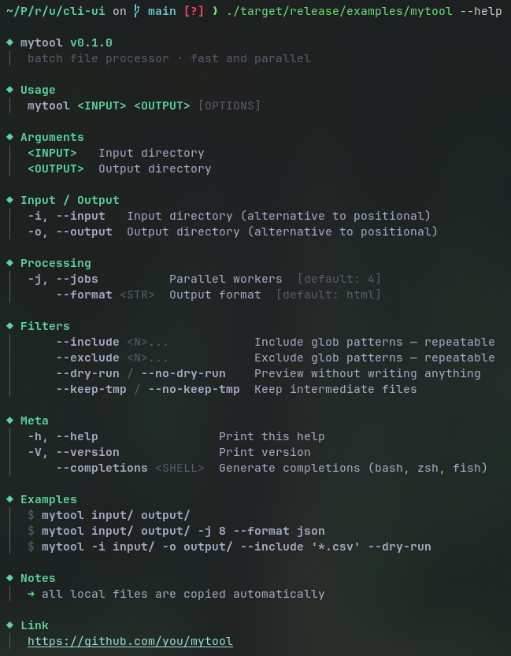
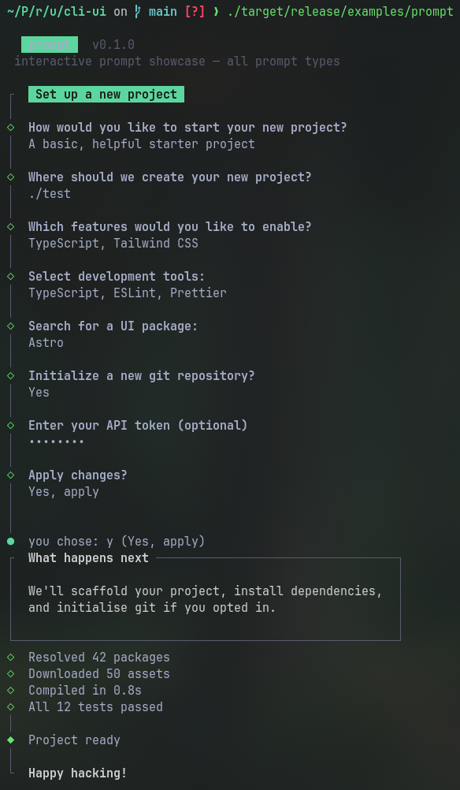

<div align="center">
  
  <h1>cli-ui</h1>
  <p>
    <strong>Styled CLI framework for Rust — derive-based argument parsing and clack-style interactive prompts.</strong>
  </p>
  <p>

<!-- prettier-ignore-start -->

[](https://crates.io/crates/cli-ui)
[](https://docs.rs/cli-ui/0.1.0)


[](https://deps.rs/crate/cli-ui/0.1.0)
<br />


<!-- prettier-ignore-end -->

  </p>
</div>

---

**Documentation**: [https://docs.rs/cli-ui](https://docs.rs/cli-ui)

**Source Code**: [https://github.com/NameOfShadow/cli-ui](https://github.com/NameOfShadow/cli-ui)

---

No `clap`. No `colored`. The runtime tree is `anstream` + `anstyle` for
output, and `crossterm` for the interactive prompts.

```rust
use cli_ui::prompt::prelude::*;

fn main() {
    intro("Set up a new project");

    let name = text("What's your name?").run().or_cancel("Cancelled.");
    let go   = confirm("Continue?").default(true).run().or_cancel("Cancelled.");

    outro(format!("Hi {name}, {}.", if go { "going" } else { "stopping" }));
}
```

```text
┌  Set up a new project
│
◆  What's your name?
│  Alice
│
◆  Continue?
│  ● Yes / ○ No
└  Hi Alice, going.
```

---



---

Themed `--help` — sections, alignment, dimmed placeholders, all automatic:



---

## Features

- **`#[derive(CliOptions)]`** — typed argument parsing with zero boilerplate
- **Themes** — colour your badge and accents in one line
- **`--help`** — generated automatically, fully styled, sections and alignment included
- **`--version`** — themed badge
- **`--completions`** — bash, zsh, fish out of the box
- **Progress** — `(n/total)` counter, URL truncation, remote/local source labels
- **`summary!`** — per-section key alignment, `DONE` / `WARN` badges
- **Interactive prompts** — text, select, multiselect, confirm, password,
  autocomplete, date, path, spinner, tasks, log lines — clack-style framing
  with full color/theme customisation. See [Prompts](#prompts) below.
- **Pipe-safe** — ANSI stripped automatically when output is redirected
- **Cross-platform** — Linux, macOS, Windows 10+

---

## Installation

```toml
[dependencies]
cli-ui = { path = "../cli-ui" }
```

Requires Rust **1.70+**.

---

## Quick start

```rust
use std::path::PathBuf;
use cli_ui::{CliOptions, Progress, header, phase, step, substep, ok, bail, summary};
use cli_ui::styles::{paint, CYAN, BOLD, OK, YELLOW, DIM, ERR};
use cli_ui::progress::format_bytes;

#[derive(CliOptions)]
#[cli(
    about   = "batch file processor",
    tagline = "fast and parallel",
    theme   = "cyan",
    example = "mytool input/ output/",
    example = "mytool input/ output/ -j 8 --format json",
    hint    = "local files are copied automatically",
    url     = "https://github.com/you/mytool",
)]
struct Opt {
    /// Input directory
    #[arg(positional)]
    input: PathBuf,

    /// Output directory
    #[arg(positional)]
    output: PathBuf,

    // ── Input / Output ────────────────────────────────────────────────
    /// Input directory (alternative to positional)
    #[arg(section = "Input / Output", short = 'i', long = "input", conflicts_with = "input")]
    alt_input: Option<PathBuf>,

    // ── Processing ────────────────────────────────────────────────────
    /// Parallel workers
    #[arg(section = "Processing", short = 'j', long = "jobs", default = 4)]
    jobs: usize,

    /// Output format
    #[arg(section = "Processing", long = "format", default = "html")]
    format: String,

    // ── Filters ───────────────────────────────────────────────────────
    /// Include patterns — repeatable
    #[arg(section = "Filters", long = "include", multi)]
    include: Vec<String>,

    /// Preview without writing
    #[arg(section = "Filters", long = "dry-run", negatable)]
    dry_run: bool,
}

fn main() {
    let opt   = Opt::parse(); // --help, --version, --completions, errors — all automatic
    let input = opt.resolved_alt_input(); // generated from conflicts_with = "input"
    let start = std::time::Instant::now();

    if !input.exists() {
        bail!("input path does not exist: {}", input.display());
    }

    header!("mytool", env!("CARGO_PKG_VERSION"), "batch file processor", "fast and parallel");

    phase!("init", "scanning {}", input.display());
    phase!("scan", "found {} remote · {} local   jobs: {}", 8, 3, opt.jobs);

    step!("downloading");
    let pb = Progress::new(8);
    pb.ok("file", "remote", "https://example.com/data.csv", "./data/data.csv", 43_100);
    pb.fail("file", "https://example.com/broken.js", "connection timeout");
    pb.finish();

    step!("resolving references");
    substep!("https://fonts.example.com/Inter.woff2", "./fonts/Inter.woff2");

    step!("writing output");
    ok!(opt.output.join(format!("result.{}", opt.format)).display());

    let errors    = 1usize;
    let total     = 10usize;
    let bytes     = 66_300usize;
    let input_v   = paint(CYAN,   &input.display().to_string());
    let output_v  = paint(BOLD,   &opt.output.join("result.html").display().to_string());
    let files_v   = format!("{} total · {} errors", paint(OK, &total.to_string()), paint(ERR, &errors.to_string()));
    let size_v    = paint(YELLOW, &format_bytes(bytes));
    let time_v    = paint(DIM,    &format!("{}ms", start.elapsed().as_millis()));

    summary! {
        warn:    "Completed with errors",
        "input"  => input_v,
        "output" => output_v,
        section,
        "files"  => files_v,
        "size"   => size_v,
        "time"   => time_v,
    }
}
```

---

## Reference

### `#[cli(...)]` — struct attributes

| Key | Description |
|-----|-------------|
| `name = "str"` | App name. Default: struct name in kebab-case (`MyTool` → `my-tool`) |
| `about = "str"` | One-line description |
| `tagline = "str"` | Secondary line under the header badge |
| `theme = "str"` | Colour theme — see [Themes](#themes) |
| `example = "str"` | Example command — repeat for multiple |
| `hint = "str"` | Note shown below examples in help |
| `url = "str"` | Project URL |

### `#[arg(...)]` — field attributes

| Key | Description |
|-----|-------------|
| `positional` | Required positional, consumed in declaration order |
| `short = 'x'` | Short flag `-x` |
| `long = "name"` | Long flag `--name`, also accepts `--name=value` |
| `section = "Name"` | Groups the flag under a named section in help |
| `default = val` | Default when flag is absent |
| `negatable` | Generates `--flag` / `--no-flag` pair. Field must be `bool` |
| `multi` | Allows repeating the flag. Field must be `Vec<T>` |
| `conflicts_with = "field"` | Error if both are provided. Generates `resolved_*()` |

### Generated methods

| Method | Description |
|--------|-------------|
| `Opt::parse()` | Parse args. Handles `--help`, `--version`, `--completions`, unknown flags, missing positionals |
| `Opt::help()` | Print styled help to stderr |
| `Opt::completions(shell)` | Print completion script: `"bash"`, `"zsh"`, `"fish"` |
| `opt.resolved_<field>()` | For each `Option<T>` with `conflicts_with` — returns `&T`, flag or positional fallback |

### Macros

| Macro | Output |
|-------|--------|
| `header!(name, ver, about, tagline)` | Themed badge + version + tagline |
| `phase!("tag", "fmt {}", val)` | `▶  tag   message` |
| `step!("message")` | `▸  message` with blank line before |
| `substep!(url, local)` | `└─  url  →  local` |
| `ok!(path)` | `✓  path` |
| `bail!("fmt {}", val)` | Styled error + exit 1 |
| `summary! { ... }` | Aligned summary block |

### `summary!` syntax

```rust
summary! {
    done: "All done",         // green  DONE  badge
    // warn: "Had errors"     // yellow  WARN  badge
    "key1" => value1,         // right-aligned within section
    "key2" => value2,
    section,                  // new alignment group
    "longer-key" => value3,
    "k"         => value4,    // aligned to "longer-key" independently
}
```

### `Progress`

```rust
let pb = Progress::new(total);

pb.ok("kind", "remote", url, local_path, bytes);  // ✓ line
pb.fail("kind", url, "error message");             // ✘ line
pb.finish();                                        // blank line
```

`kind` is padded to 6 characters. Long URLs are truncated to fit the terminal width.

---

## Themes

```rust
#[cli(theme = "green")]
```

| Value | Badge |
|-------|-------|
| `"cyan"` *(default)* | Cyan |
| `"magenta"` / `"purple"` | Magenta |
| `"green"` | Green |
| `"blue"` | Blue |
| `"yellow"` | Yellow, black text |
| `"red"` | Red |

Affects: version badge, `◆` in help, `▶` phase markers.

---

## Prompts



Interactive prompts (text, select, password, …) are on by default — no
feature flag, no `cfg(...)` ceremony. Just import the prelude:

```toml
[dependencies]
cli-ui = "*"
```

### Hello, prompt

```rust
use cli_ui::prompt::prelude::*;

fn main() {
    intro("Set up a new project");

    let name = text("What's your name?")
        .placeholder("Anya")
        .run()
        .or_cancel("Cancelled.");

    let stack = select("Pick a stack")
        .option("rust", "Rust")
        .option("ts",   "TypeScript")
        .option("py",   "Python")
        .run()
        .or_cancel("Cancelled.");

    outro(format!("Hi {name}, you chose {}.", stack.label));
}
```

Run `cargo run --example hello_prompt` for the full walkthrough.

### What you get

| Category   | API                                                                   |
|------------|-----------------------------------------------------------------------|
| Text input | `text`, `secret`, `multiline`                                         |
| Choice     | `confirm`, `select`, `multiselect`, `groupmultiselect`, `select_key`  |
| Filter     | `autocomplete`                                                        |
| Specialty  | `date::date`, `path::path`                                            |
| Framing    | `intro`, `outro`, `note`, `cancel`, `boxed::boxed`, `log::*`, `stream::*` |
| Live work  | `spinner`, `progress`, `tasks`, `task_log`                            |
| Composition| `group::group`                                                        |

### Validation

Every rule lives at `cli_ui::prompt::*` — no submodule prefix:

```rust
use cli_ui::prompt::{secret, min_chars, has_upper, has_lower, has_digit, has_special};

let password = secret("New password")
    .rule(
        min_chars(12)
            .and(has_upper()).and(has_lower())
            .and(has_digit()).and(has_special())
            .msg("≥12 chars with upper/lower/digit/special"),
    )
    .run();
```

Library of rules: `required`, `min_chars` / `max_chars` / `exact_chars`,
`word_count`, `words_between`, `has_upper` / `has_lower` / `has_digit` /
`has_special`, `alpha_only`, `alphanumeric`, `only_chars`, `forbid_chars`,
`int_between`, `float_between`, `email`, `starts_with`, `ends_with`,
`one_of`. Compose with `.and()`, `.or()`, customise the message with `.msg()`.

For ad-hoc closures use `.validate(|s: &str| ...)` instead of `.rule(...)`;
both methods accept their natural form thanks to Rust's type inference.

### Theming

Every visual style is one struct field away:

```rust
use cli_ui::prompt::update_colors;

update_colors(|c| {
    c.accent = anstyle::Style::new()
        .fg_color(Some(anstyle::Color::Ansi(anstyle::AnsiColor::Magenta)))
        .bold();
});
```

Slots: `accent`, `active`, `input`, `success`, `error`, `cancel`, `dim`,
`header`, `header_plain`, `title`, `intro_badge`. Also configurable via
`cli_ui::prompt::settings::update`: vim keybindings (`h/j/k/l`), bold
headers, hint visibility, default cancel / error messages.

### Cancellation

Ctrl-C and Esc come through as `PromptError::Interrupted`. The
`OnCancel` extension trait turns that into a clean exit:

```rust
use cli_ui::prompt::{text, OnCancel};
let name = text("Name").run().or_cancel("Aborted.");
```

### Extending

Implement [`prompt::core::Prompt`](src/prompt/core/mod.rs) — `handle(key)
-> Step<T>`, `render(ctx) -> Frame`, `render_answered(&T) -> Frame`. The
generic runner owns raw mode, the key loop, the validation transition,
the answered redraw, and cleanup.

### Examples

| File                          | Shows                                     |
|-------------------------------|-------------------------------------------|
| `examples/hello_prompt.rs`    | smallest possible flow                    |
| `examples/prompt.rs`          | every prompt type                         |
| `examples/prompt_validate.rs` | composable validators + Ctrl-C handling   |

---

## Shell completions

```bash
mytool --completions bash >> ~/.bash_completion
mytool --completions zsh  > ~/.zfunc/_mytool
mytool --completions fish > ~/.config/fish/completions/mytool.fish
```

---

## Pipe and colour safety

| Context | Behaviour |
|---------|-----------|
| Interactive terminal | Full ANSI colours |
| `cmd 2>file` | Plain text in file |
| `NO_COLOR=1` | Plain text |
| `TERM=dumb` | Plain text |
| Windows 10+ | Full ANSI via VT mode |
| Windows <10 | Plain text |

---

## Dependencies

**Runtime** (in your binary):

| Crate | Purpose |
|-------|---------|
| `anstream` | Pipe detection, ANSI stripping, `NO_COLOR` |
| `anstyle` | Zero-alloc style constants |
| `windows-sys` | Terminal width on Windows *(Windows only)* |

**Compile-time only** (not in binary):

| Crate | Purpose |
|-------|---------|
| `syn` + `quote` + `proc-macro2` | Derive macro |
| `heck` | Struct name → kebab-case |

---

## Subcommands

For tools with multiple commands (`mytool download`, `mytool upload`, etc.)
use `#[derive(CliCommand)]` on an enum instead of `#[derive(CliOptions)]`.

```rust
use cli_ui::{CliCommand, CliOptions, Result};

#[derive(CliOptions)]
struct Global {
    #[arg(short = 'v', long = "verbose", negatable)]
    verbose: bool,
}

#[derive(CliCommand)]
#[cli(about = "network diagnostics")]
enum NetCmd {
    /// Download from a network endpoint
    #[cli(alias = "dl")]
    Download(NetDownloadOpt),  // mytool net download <url>

    /// Check connectivity
    Ping,                      // mytool net ping  — no options
}

#[derive(CliCommand)]
#[cli(
    name   = "mytool",
    about  = "batch file processor",
    theme  = "cyan",
    global = Global,           // global flags parsed before subcommand
)]
enum Cmd {
    /// Download a file
    #[cli(alias = "dl")]
    Download(DownloadOpt),     // mytool download <url>
                               // mytool dl <url>

    /// Upload a file
    #[cli(alias = "up")]
    Upload(UploadOpt),

    /// Network diagnostics
    #[cli(alias = "net")]
    Network(NetCmd),           // mytool network ...  — nested subcommands

    /// Show current status
    Status,                    // mytool status  — unit variant
}

fn main() -> Result<()> {
    match Cmd::parse()? {
        Cmd::Download(opt) => download(Cmd::global(), opt),
        Cmd::Upload(opt)   => upload(Cmd::global(), opt),
        Cmd::Status        => status(Cmd::global()),

        Cmd::Network(sub) => match sub {
            NetCmd::Download(opt) => net_download(Cmd::global(), opt),
            NetCmd::Ping          => net_ping(Cmd::global()),
        },
    }
    Ok(())
}
```

### What you get for free

- `mytool --help` — lists all subcommands with their descriptions
- `mytool download --help` — shows options for that specific command
- `mytool net --help` — shows nested subcommands
- `mytool help download` ≡ `mytool download --help`
- `mytool --version` — themed badge, root level only
- `mytool --completions zsh` — full command tree including nested commands
- `mytool tyop` → `✘ unknown command: tyop` + `did you mean: top?`
- `mytool -v download <url>` ≡ `mytool download -v <url>` — global flags anywhere

### `#[cli(...)]` on enum variants

| Key | Description |
|-----|-------------|
| `alias = "str"` | Short alias — repeat for multiple: `#[cli(alias = "dl", alias = "fetch")]` |
| `about = "str"` | Override the doc comment description in help |

### Notes on `Cmd::global()`

Global options are stored in a `OnceLock` set during `parse()` — safe for
CLI utilities. For libraries or code that calls `parse()` multiple times in
the same process, pass global options explicitly:

```rust
// instead of Cmd::global()
let (global, cmd) = Cmd::parse_with_global()?;  // alternative API
```

---

## License

MIT — see [LICENSE](LICENSE).

## Changelog

See [CHANGELOG.md](CHANGELOG.md).